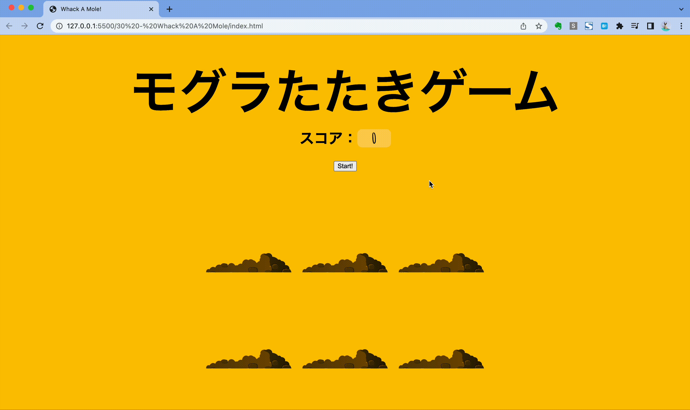

# モグラたたきゲーム



## フォルダ階層

```
mole
├── index.html
├── script.js
└── style.css
```

## プログラムの流れ

1. startボタンをクリック
2. 10秒のカウント開始
3. ランダムでどこか一つの穴からモグラを表示させ、1秒たったら非表示に
4. モグラが表示されている間に、モグラをクリックしたらスコアを加算し表示
5. 10秒のカウントが残っていれば 3を実行
6. 10秒のカウントが終了していれば 3の実行を終了しアラートで結果表示

## 使用するメソッドやプロパティ

|メソッド名|用途|
|:--|:--|
|querySelector()|スコア(.score)やボタン(button)要素取得|
|querySelectorAll()|穴(.hole)やモグラ(.mole)要素取得|
|addEventListener()　又は onClick()|startボタンがクリックされた時のゲーム開始とモグラがクリックされた時のスコア加算|
|textContent|スコアの表示|
|style.visibility|ボタンの表示・非表示|
|classList.add()|特定の要素に引数のクラス名を追加する。モグラの表示時に使用|
|classList.remove()|特定の要素に引数のクラス名があればそのクラス名を削除する。モグラの非表示時に使用|
|Math.random()|ランダム値を生成|
|Math.floor|値を丸める|
|||
